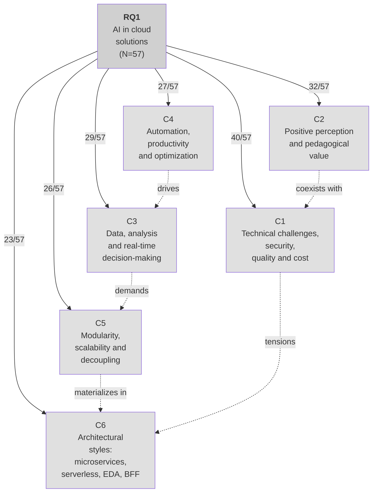

# Thematic Network RQ1

Edge labels indicate frequency (n/N=57).

## Interpretation

Students' perception of AI was structured by a tension between value and viability:
- **Technical challenges** (70.2%) - costs, risks, latency, dependency on external services
- **Positive perception** (56.1%) - pedagogical and professional potential
- **Association with data** (50.9%) - real-time decision-making, analysis
- **Automation** (47.4%) - productivity and optimization
- **Modularity** (45.6%) - scalability and decoupling
- **Architectural styles** (40.4%) - microservices, serverless, EDA, BFF

AI does not appear only as functionality, but as a decision subject to architectural trade-offs.

## Evidence Examples from Student Responses

### C1 - Technical challenges, security, quality and cost (40/57 = 70.2%)

- "The biggest challenges are **cost, latency and the complexity of integrating AI models into production**."
- "The challenge is **ensuring efficient integration and control of AI models in production**."
- "Challenge: **latency and coordination of complex events**."
- "Challenge: the **execution time limits and cold starts can affect heavy models**."
- "Challenges include **costs and managing models in production**."
- "The main challenge is **ensuring performance, security, and efficient integration between services**."
- "I believe that AI accelerates several development processes and the integration of the technologies studied, but it generates some challenges, such as **increased code complexity, maintenance difficulties, and the emergence of technical debt**."
- "The main challenge is **dealing with high resource consumption and model integration**."
- "The challenges are **taking care of LGPD, model cost and latency, versioning prompts/models, and having decent observability of calls**."
- "The challenge lies in **orchestration, cost, and model governance**."
- "The main challenge is **orchestrating and monitoring AI models in distributed environments, ensuring performance and data governance**."
- "The main challenges are **latency** (addressed with cache and asynchronous processing) and **costs** (mitigated with optimized models and monitoring)."
- "Regarding challenges, **cost and latency** can be considered."
- "The main challenge is **dealing with cost and data quality**."
- "I would highlight intelligent scalability and automation of systems as opportunities, while challenges may lie in **integrating AI models with APIs, processing cost, and maintaining data security and privacy**."
- "Challenge: **preventing overload in the BFF and ensuring consistency across channels**."
- "Challenges include **ensuring data quality and maintaining good integration between services**."
- "The most challenging part would be **balancing performance and cost, since running large models in the cloud can be expensive**."
- "However, there are still challenges such as **cost, latency, security, and maintaining models in production**."
- "**Variable quality** - suggestions are not always the best; **Security** - care with shared sensitive data."

### C2 - Positive perception and pedagogical value (32/57 = 56.1%)

- "I believe that the integration of AI into the classes was **extremely beneficial**, since we are using a tool that is **widely used nowadays**."
- "**It was interesting** to see AI applied with cloud."
- "I found it **very interesting** to learn how modern architectures use AI and cloud to create smarter and more scalable systems."
- "**Very good** for learning and understanding the concept of the tools."
- "The integration of AI into these architectures has been **very interesting**."
- "I found AI's fit into the architectures **very good**, functioning as a scalable service in Microservices."
- "I liked the fact that the professor '**encouraged**' the use of AI, but in the **correct way**."
- "AI **not only helped us a lot** in executing work in activities we did not master, offering assistance and guiding learning."
- "**There were no difficulties attributed to AI**; as a support tool, it proved to be **very useful**."
- "I think AI is a **powerful tool**. It **helps me a lot** in college in general."
- "AI was **useful as an assistant** during the process of creating and implementing architectures."
- "The use of artificial intelligence was **fundamental** for the application of the course."
- "AI is a **very powerful tool** in application development with these architectures."
- "The integration of AI **greatly facilitated** manual tasks related to the studied architectures."
- "I found that the use of AI **greatly facilitated** project development."
- "**Excellent** in terms of microfrontend development."

### C3 - Data, analysis and real-time decision-making (29/57 = 50.9%)

- "Handling **real-time data flows** (for example, anomaly identification in sensors)."
- "The integration of AI into modern architectures allowed **decisions and analyses to be automated in real time**."
- "**Real-time analysis**, personalization, and better scalability."
- "In event-driven architectures, it **reacts in real time to data flows**."
- "**Data extraction, semantic search**, and recommendations."
- "In microservices and BFFs, it enables independent intelligent services; in event-driven and serverless, it **reacts instantly to data**."
- "**Real-time decision support**."
- "In Event-Driven, it **reacts to real-time events**."
- "In event-driven architectures, where AI can process event flows for **analysis and quick responses**."
- "Opportunities include **automation and intelligent data analysis**."
- "**Data-driven systems**."
- "The greatest opportunities are in **automation and real-time analysis**."
- "In event-driven architectures, for example, AI can **react in real time to large volumes of data**."
- "In EDA, AI **reacts in real time**, which greatly helped with instant recommendations and error detection."
- "Using AI in microservices and cloud to **automate decisions** and improve the user experience."
- "For fast **decisions and automation**."
- "Such as in systems that use **recommendations or intelligent data analysis**."

### C4 - Automation, productivity and optimization (27/57 = 47.4%)

- "AI can make the architect's life easier, especially when **developing artifacts (especially code), reducing the time**."
- "**Accelerate development** - quickly generate boilerplate code."
- "It helps **automate processes, improve decisions**, and greatly supports implementation efficiency."
- "The presence of AI enables **greater automation and system adaptation**."
- "The use of AI integrated into architectures facilitated the understanding of integration patterns, scalability, and communication between services, enabling the construction of **more efficient solutions**."
- "AI **accelerates** several development processes."
- "The greatest opportunities are in **automation and real-time analysis**."
- "Bringing **automation**, real-time analysis, and efficiency."
- "**Automate analyses** and improve business decisions."
- "**Accelerating development** and the creation of solutions."
- "The integration of AI **greatly facilitated** manual tasks."
- "AI helped with tasks such as **generating code, suggesting patterns, explaining concepts, and accelerating development**."
- "It helped **automate processes** and improve decisions."
- "Made the implementation process **more agile and practical**."
- "Opportunities are in **automation and personalization**."
- "To **optimize processes** and decision-making."
- "**Intelligent automation**."

### C5 - Modularity, scalability and decoupling (26/57 = 45.6%)

- "AI can be **encapsulated in independent services**. This **facilitates scalability and reuse**."
- "**Scale independently**. The greatest opportunities are in automation."
- "It makes systems **smarter and more automated**, enabling real-time analysis, personalization, and **better scalability**."
- "AI can function as an **independent service**, facilitating updates and **scalability**."
- "AI is easily integrated into architectures such as Microservices and Serverless, allowing each service to use specific models **independently and scalably**."
- "AI integrates well into microservices, bringing **scalability**."
- "Bringing **scalability** and automation."
- "To make systems **smarter and more scalable**."
- "Understanding how to combine AI with **distributed and scalable architectures**."
- "To create **scalable and intelligent solutions**."
- "To create **modular and intelligent solutions**."
- "The integration of Artificial Intelligence into modern architectures, such as Microservices and Serverless, makes it possible to **scale AI models efficiently**."
- "Creating **modular systems** that use AI naturally."
- "Creating **scalable and intelligent solutions**."
- "Creating **more modular, intelligent, and easy-to-maintain solutions**."
- "Designing **scalable systems** that use AI to optimize processes."

### C6 - Explicit mention of architectural styles (23/57 = 40.4%)

- "**Microservices**: AI can be encapsulated in independent services."
- "**Event-Driven**: AI adapts well to event-based architectures."
- "**Serverless**: serverless functions enable on-demand inference execution."
- "**BFF**: AI has the ability to personalize the user experience."
- "AI integrates well into architectures such as **Microservices and Serverless**."
- "Integrating AI into architectures such as **Microservices, Event-Driven, Serverless, and BFF** brings many advantages."
- "Such as **microservices and serverless**, to make systems smarter."
- "In **microservices**, AI can function as an independent service."
- "Using the C4 Model to visualize different levels and arc42."
- "I intend to apply **Microservices** in AI and the use of **Serverless**."
- "AI fits well into the studied architectures: in **Microservices**, as an isolated specialized service; in **Event-Driven**, through asynchronous processing; in **Serverless**, with Azure Functions for on-demand inference; and in **BFF**, as an orchestrator."
- "In **microservices** architectures, AI can act in autonomous decisions."
- "I intend to apply Microservices in AI."
- "In **Microservices**, it is possible to have specific AI services; in **Event-Driven**, it reacts to real-time events; in **Serverless**, it executes models on demand; and in **BFF**, it personalizes the user experience."
- "Such as **microservices, serverless, and event-driven**."
