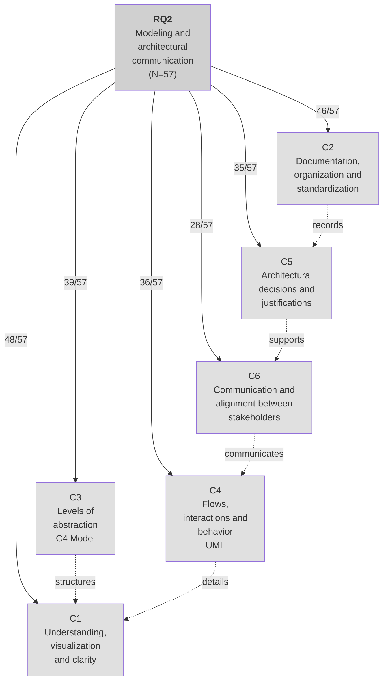

# Thematic Network RQ2

**Architectural modeling as support for understanding and communicating decisions in solutions with AI and cloud**

Edge labels indicate frequency (n/N=57).

## Interpretation

Architectural models played a central role in the experience:
- **Understanding and clarity** (84.2%) - architecture visualization
- **Documentation** (80.7%) - organization and standardization
- **C4 Model** (68.4%) - levels of abstraction
- **UML** (63.2%) - flows and interactions
- **Decisions** (61.4%) - architectural justifications
- **Communication** (49.1%) - alignment between stakeholders

Modeling functioned as cognitive and communicational mediation, helping students decompose the complexity of solutions with AI and cloud, make choices explicit, and make architecture more discussable.

## Evidence Examples from Student Responses

### C1 - Understanding, visualization and clarity (48/57 = 84.2%)

- "**Visualizing solutions at different levels**."
- "They helped **visualize the system structure**, define responsibilities, and explain complex interactions."
- "They help **organize and better visualize** architectural decisions."
- "They **facilitate team communication** by showing how components connect."
- "The use of arc42, C4 Model, and UML **facilitated the visualization** of the structure."
- "Models such as arc42, C4, and UML helped me a lot to **visualize** where AI components fit into the solution."
- "I believe that having **something visual to illustrate the architecture**."
- "**Facilitated the visualization**, documentation, and communication of architectural decisions."
- "Models such as arc42, C4, and UML help **visualize and explain** how AI and the cloud connect."
- "These models help a lot in **visualizing the structure** and flows between components."
- "**C4 helps me make clear** who talks to whom and where AI enters the flow."
- "They make it easier to **understand how solution components connect**."
- "These models **facilitated the visualization and understanding of the system**."
- "It helped basically in all stages. Since I had the project description and a well-made Canvas, AI **understood it very well**."
- "They helped me have a **holistic and somewhat simplified view** of the project."
- "It helped me **understand** how AI and Cloud fit into systems."
- "The use of models such as arc42, C4 Model, and UML was essential to structure, **visualize**, and communicate architectural decisions."
- "Models such as arc42, C4, and UML help **visualize** and communicate how AI components fit."
- "The models made it **easier to visualize and explain** the project architecture."
- "The models helped **visualize and explain** where AI fits into the solution."
- "The use of models such as arc42, C4 Model, and UML greatly **facilitated the understanding** and communication."
- "These models helped me a lot to **understand the architecture in a more visual and organized way**."
- "The use of models such as arc42, C4, and UML helped a lot to make architectural decisions **clearer and more visual**."
- "The use of models such as arc42, C4 Model, and UML helped **better visualize** AI components within the architecture."

### C2 - Documentation, organization and standardization (46/57 = 80.7%)

- "**arc42** helped organize."
- "Helped me realize how useful they are to properly **define and delimit the scope**."
- "**arc42** organized and **documented** technical decisions and their risks."
- "I really liked the **C4 Model** and intend to apply it in future projects."
- "**arc42** (with ADRs) records why I chose each approach."
- "They helped a lot to **organize and better visualize** ideas."
- "**arc42 guided** decisions, C4 showed levels of detail."
- "It helped **basically in all stages**."
- "It helped me understand how AI and Cloud fit into systems, using the **C4 Model** to visualize different levels and **arc42** to ensure that important points were clear and **documented**."
- "**arc42** helped **document** the motivations and technical constraints of the solution."
- "**Document** decisions following **arc42**."
- "It adequately represents both the macro view of the solution (with **C4 and arc42**) and implementation details (with **UML**)."
- "These models helped make the project much **more organized and structured**."
- "**arc42** contributed by providing a **systematic guide** to document the architecture."
- "The use of **arc42, C4 Model, and UML** models greatly facilitated the understanding and communication of architectural decisions."
- "**Organized the documentation in a structured way**."
- "They helped **better plan** where AI fits and how it connects to the cloud."
- "The **models are useful and essential** throughout the entire life cycle of the project."
- "**C4, arc42, and UML** helped a lot to make architectural decisions clearer."
- "The whole **documentation and diagramming** part helped a lot."
- "The use of models such as **arc42, C4, and UML** facilitated the visualization of the solution structure."
- "**arc42, C4, and UML** helped me a lot to visualize the layers and components."

### C3 - Levels of abstraction / C4 Model (39/57 = 68.4%)

- "**C4 Model**: helps with visualization at **different levels of abstraction** (context, containers, components, code)."
- "Using the **C4 Model** to visualize **different levels**."
- "**C4** showed **levels of detail**."
- "The **C4 Model** helped visualize the **different levels** of the architecture."
- "The **C4 Model** facilitated the hierarchical representation from **context to components**."
- "The **C4 Model**: Showed the architecture in **levels (context → containers → components)**."
- "**C4** shows the architecture."
- "The **C4 Model** mainly exposes a very interesting and clear view."
- "For example, the **C4 Model** made me better understand the **relationship between the levels**."
- "The use of models such as arc42, **C4**, and UML."
- "The **C4 Model levels** helped me a lot in understanding how the connections between **containers and components** would be made."
- "They show **from the general view to the technical details**."
- "**From the macro view to the component details**."

### C4 - Flows, interactions and behavior / UML (36/57 = 63.2%)

- "**UML**: useful for describing **data flows, integrations**, and relationships."
- "**UML** showed the **flows and interactions** between components."
- "**UML sequence diagrams** show the request path from end to end."
- "**Sequence diagrams** showed the **flow** with AI (request → processing → response)."
- "The use of AI helped our team develop the **sequence diagrams** for the project."
- "**UML** helped document **flows and integrations** in a clear and standardized way."
- "Better understanding the **user flow** through the system."
- "Showing how each part **interacts**."

### C5 - Architectural decisions and justifications (35/57 = 61.4%)

- "arc42: offers an organized structure to **record architectural choices**, covering **risks, trade-offs, and justifications**."
- "**Justifying** choices; explaining why we use certain components."
- "arc42 (with ADRs) **records why I chose each approach**, which provides **traceability**."
- "Made **technical decisions clear** (why we chose a certain solution)."
- "**arc42 justifies decisions**."
- "They were great for separating and **understanding each decision made**."
- "Communicate **technical decisions** better."
- "**Avoiding misunderstandings** and ensuring that everyone understands the purpose of each part of the solution."
- "**Reducing ambiguities** and improving **decision-making**."
- "Facilitating **communication between technical and non-technical teams**."
- "It also supports **technical decision-making** and team alignment."
- "Which **decisions to make**."

### C6 - Communication and alignment between stakeholders (28/57 = 49.1%)

- "Make **communication between technical and business teams clearer**, reducing ambiguities."
- "They **facilitate team communication**."
- "**Facilitated communication** within the team."
- "**Facilitating communication** between teams."
- "**Facilitates alignment**; architecture became more **communicable**."
- "They make **communication among team members much clearer**."
- "They help **communication** between teams, **avoiding misunderstandings**."
- "These approaches enable **shared understanding, technical alignment**, and transparency in decisions."
- "**Clearer communication** within the team."
- "**Ensuring a shared view** among everyone involved."
- "They helped **better align the team**."
- "Promoting understanding of the software **for all stakeholders**."
- "To **communicate** in a standardized and **collaborative way** with the team."
