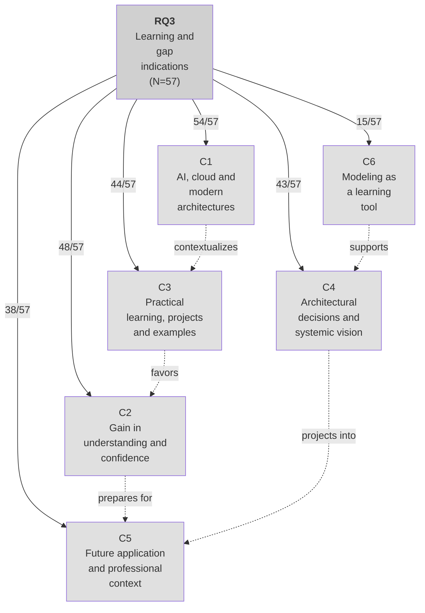

# Thematic Network RQ3

Edge labels indicate frequency (n/N=57).

## Interpretation

The experience was perceived as an opportunity to approach modern architectures:
- **AI, cloud and modern architectures** (94.7%) - dominant theme
- **Gain in understanding** (84.2%) - acquired confidence
- **Practical learning** (77.2%) - projects and examples
- **Systemic vision** (75.4%) - architectural decisions
- **Future application** (66.7%) - professional context
- **Modeling as learning** (26.3%) - lower frequency

## Evidence Examples from Student Responses

### C1 - AI, cloud computing and modern architectures (54/57 = 94.7%)

- "I work with **cloud architectures**, and integrating **AI** into this context would be extremely interesting."
- "Main lessons: Balance innovation and governance; Consider scalability; Use **arc42 + C4** for documentation."
- "Learning how to connect and integrate **Azure applications** into the project."
- "I intend to apply this knowledge in future projects **using cloud services**."
- "Understanding how **AI can be integrated into modern architectures**, such as **microservices and serverless**."
- "Learning to **model a system** not only in a monolithic way, but mainly by dividing the software into parts."
- "I intend to apply this knowledge in future projects by creating intelligent solutions with **microservices and serverless functions**."
- "I intend to apply this knowledge in future **automation projects, cloud solutions**, and predictive analysis."
- "**The support from AI tools** was crucial in correcting errors during the development of **cloud systems**."
- "I intend to apply this knowledge by developing **APIs and microservices** that use AI."
- "I already used AI to help define and organize my code in the context of my internship, but learning more about **modern solution architecture** gave me a more solid direction."
- "How **modern architectures** use AI and cloud to create **smarter and more scalable systems**."
- "I learned how to use **AI in modern architectures** and intend to apply it by creating **modular and scalable** solutions."
- "Learning to **combine AI with cloud services** showed the power of elasticity and distributed processing."
- "I intend to apply this knowledge by adopting **modular, event-driven architectures with serverless functions**."
- "I learned how to **combine AI and cloud in modern architectures**."
- "In future projects, I intend to treat **AI as a specialized microservice**, use **serverless** for on-demand inference."
- "Understanding the challenges and opportunities arising from integrating **AI into architectures** such as **Microservices, Serverless, and BFF**."
- "I noticed new ways to organize projects and learned about **platforms I had never used**."
- "I believe it was more directed toward development than architecture itself, with the initiation of **application construction**."
- "**AI** was very useful for developing **Dockerfiles**."
- "I intend to apply this knowledge in future projects by **using AI more strategically**."
- "I intend to apply this knowledge by developing **modular and intelligent solutions**."
- "**Use of AI in development**: seeing in practice how AI can accelerate and assist work."
- "**Modern tools**: learning about current **cloud services and AI tools**."
- "**Integrate AI intelligently**: know where it makes sense to use AI and where it does not."
- "I intend to apply this by keeping **AI modular, scalable, and well documented**."
- "What contributed most was understanding how to integrate **AI into scalable cloud architectures**."
- "I intend to use this knowledge to design **intelligent and distributed systems**, combining **AI and cloud**."
- "What contributed most was understanding how **AI can be integrated in practice into modern architectures**, taking advantage of **scalability and modularity**."
- "The integration of AI into these architectures brings a lot of **flexibility and intelligence** to systems."
- "What contributed most was understanding how **AI fits within modern architectures**, especially in **cloud and microservices**."
- "What contributed most to my learning was understanding how **AI integrates with the cloud and distributed architectures**."
- "What contributed most was understanding how **architecture connects to AI in practice**."
- "I intend to apply this by creating **modular systems that use AI naturally**."
- "What contributed most was understanding how **AI integrates into modern architectures**, combining theory and practice in the **cloud**."
- "The learning helped my understanding of how **cloud architecture** works internally."
- "What contributed most to my learning was understanding in practice how **modern architectures support intelligent solutions**, combining **AI with cloud and microservices**."

### C2 - Architectural understanding and systemic thinking (48/57 = 84.2%)

- "**Architectural thinking** greatly improved."
- "Understanding that by properly defining the project, it is possible to feed AI with **rich context**."
- "How **AI can be integrated into modern architectures** to make systems smarter."
- "Understanding how to **combine AI with distributed and scalable architectures**."
- "Understanding **integration patterns, scalability, and communication between services**."
- "Understanding how to **combine AI with cloud computing** to create scalable and intelligent solutions."
- "Having everything **well organized and structured**."
- "Understanding that **architecture is not only about technology, but about making conscious decisions**, balancing quality, cost, performance, and evolution."
- "The greatest learning was understanding how **modern architecture serves as a basis for the efficient use of AI**, integrating scalability, data governance, and automation."
- "I learned that **AI only generates value when it is well integrated into the architecture**."
- "Understanding how **AI integrates with scalable cloud architectures**."
- "Understanding how **AI integrates into modern architectures**, from use in **data pipelines** to automation."
- "What contributed most was understanding how **AI can be integrated in practice into modern architectures**."
- "What contributed most was understanding **how architecture connects to AI in practice**. We learned to think about all aspects that affect the application."
- "Understanding **in practice how modern architectures support intelligent solutions**."
- "What contributed most was understanding in practice how **modern architectures support intelligent solutions**, combining AI with cloud and microservices."
- "That **architecture is not only about structure, but also about how components communicate and scale**."
- "The fact that, with AI, I could already have an idea of how to **correctly implement the architectures** in the system."
- "Understanding how **modern solution architecture** gave me a more solid direction on how to **structure and optimize** this process."

### C3 - Practical learning and iteration (44/57 = 77.2%)

- "What helped most were the **practical case studies** and cloud practices."
- "I intend to create a strong documentation 'base' about the project to **speed up development** as much as possible."
- "The **practical activities** helped a lot to better understand this context."
- "**Hands-on practice**: actually implementing the projects was essential; theory alone is not enough."
- "Seeing **real examples and testing tools** helped visualize the impact of architectural choices."
- "The **practice of implementing microservices**, BFF, and serverless provided a basis for understanding where AI fits."
- "**Practical demonstrations by the professor**."
- "The development of the **course project** helped with this, being able to put into practice the idea planned."
- "Learning about **AI in this context opened my mind** to think about smarter and more automated solutions."
- "I learned more by **getting hands-on** with real goals (SLA, P95) than by reading theory."
- "I intend to apply this knowledge by **seeking to create** smarter, scalable, and well-structured systems."
- "I already used AI to help define and organize my code in the context of my **internship**."
- "AI primarily helped with **coding**."
- "The group already understood the concepts that were presented in class, but **putting this knowledge into practice** and carrying out a cloud project would have been more challenging without any use of AI."
- "The **ease of correcting errors** and asking technical questions."
- "**Personal projects**: use these architectures in my own applications."
- "**Professional work**: propose scalable and well-structured solutions."

### C4 - Architectural and systemic vision (43/57 = 75.4%)

- "Visualizing solutions at **different levels**."
- "**Integration with AI** in these architectures was useful for making solutions more efficient."
- "Understanding how to **combine AI with distributed and scalable architectures**."
- "**Systemic thinking**; relationship between services."
- "Understanding that architecture is not only about technology, but about **making conscious decisions, balancing quality, cost, performance, and evolution**."
- "The greatest learning was understanding how **modern architecture serves as a basis** for the efficient use of AI."
- "Understanding how AI integrates with the cloud and **distributed architectures**."
- "We learned to **think about all aspects that affect the application**."
- "I intend to apply this by creating **modular systems** that use AI naturally, taking advantage of the best cloud architectures."
- "I intend to apply this knowledge by creating **scalable and intelligent solutions**."
- "Learning about AI in this context **opened my mind** to think about smarter and more automated solutions."
- "**Think about scalability**: design systems prepared to grow."
- "Acquiring **architectural knowledge taught me a lot about decision-making** for defining software attributes."
- "Helped me **better understand how technologies work in practice** and how they are used in different solutions."
- "**Seeing in practice** how AI integrates into architectures and understanding the **decisions behind each choice**."
- "It gave an **overview of the organization** of the components and their relationships, and how the **right architectural decision matters** for the future of the project in terms of scalability and performance."

### C5 - Practical application in real scenarios (38/57 = 66.7%)

- "As mentioned, I work with **cloud architectures**."
- "I intend to apply this knowledge in future projects **using cloud services**."
- "In future projects, I intend to create a strong documentation 'base' about the project."
- "I intend to continue using AI this way **in the future**."
- "I intend to apply what I learned in the TDE and formative activities both in **personal and professional projects**."
- "I intend to use this knowledge to **improve my technical perspective** and collaborate better in future projects."
- "I will apply this knowledge by **creating more scalable solutions, automating processes**, and improving decisions in **real projects**."
- "I intend to apply this knowledge **in future projects** by seeking to create smarter, scalable, and well-structured systems."
- "I intend to apply this knowledge by creating **modular and intelligent solutions**."
- "I intend to use this knowledge to design **intelligent and distributed systems**."
- "I intend to apply this knowledge by developing **smarter and more efficient solutions**."
- "I intend to apply this knowledge **in future projects** by creating more modular, intelligent, and easy-to-maintain solutions."
- "I intend to apply this knowledge by designing **scalable systems** that use AI to optimize processes."
- "In **future projects**, I want to apply this by creating **modular systems** that use AI naturally."
- "I intend to apply this knowledge by creating **scalable and intelligent solutions**."
- "**Personal projects**: use these architectures in my own applications; **Professional work**: propose scalable and well-structured solutions."
- "**Share knowledge**: teach other developers about good practices."
- "I intend to apply this knowledge in **real projects and/or opportunities within the company where I currently work**."
- "I intend to use AI in **microservices and cloud** to automate decisions."
- "I intend to **expand my range of options** and make the best decisions in my next projects."
- "I already use architecture with **repositories and use cases at work**."

### C6 - Modeling as a learning tool (15/57 = 26.3%)

- "**Visualization with models**: C4, arc42, and UML helped **'see' the architecture**."
- "**Document better**: use the learned models to communicate decisions."
- "The **C4 Model levels** helped me a lot in understanding."
- "They helped me have a **holistic and somewhat simplified view** of the project."
- "It helped me understand how AI and Cloud fit into systems, using the **C4 Model to visualize** different levels."
- "The **C4 Model** made me better understand the relationship between the levels."
- "The use of models such as **C4 and arc42** helped visualize and communicate technical decisions better."
- "Using **Mermaid** greatly facilitated the creation of diagrams."
- "**Structured documentation** (C4/arc42) showed how to communicate technical decisions."

## Indications of Curricular Gaps

Themes with low recurrence indicate gaps:
- **MLOps** - little relation to operational lifecycle
- **Model drift** - evolution and degradation of models did not appear
- **AI governance** - auditing, accountability, and compliance rarely cited
- **Continuous observability** - monitoring and traceability not highlighted
- **Explainability** - interpretation of decisions was not a frequent concern

The experience favored an initial understanding of AI as an architectural component, but has not yet consolidated a complete operational vision of AI-enabled systems.
